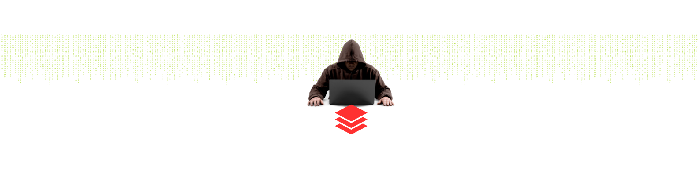

<!--
**Cakecofee/Cakecofee** is a ✨ _special_ ✨ repository because its `README.md` (this file) appears on your GitHub profile.

Here are some ideas to get you started:

- 🔭 I’m currently working on ...
- 🌱 I’m currently learning ...
- 👯 I’m looking to collaborate on ...
- 🤔 I’m looking for help with ...
- 💬 Ask me about ...
- 📫 How to reach me: ...
- 😄 Pronouns: ...
- ⚡ Fun fact: ...
-->

---

<!--Header: end-->

<!--Social Links Badges: start-->

 
 

  

<!--Social Links Badges: end-->

<!--About me: start-->
  
  
Greetings 👋, my name is Ivan Fernandez, I am a dedicated graduate student pursuing a Master of Science in Mechanical Engineering. My primary goal is to deepen my knowledge of this exciting field through a combination of education, industry experience, and research projects.

<!--About me: end-->

<!--Tech stack: start-->

  
  ---
<!--Tech stack: end-->

<!--Statistics: start-->

  
  

<!--Statistics: end-->

<!--More Details: start-->

### Languages 🌐

| Language      | Proficiency                                                               |
| ------------- | ------------------------------------------------------------------------- |
| English       | Native or bilingual                                                       |
| Spanish       | Native or bilingual                                                                    

---

### Eucation 📚 : 

<!-- CURRENT:START -->
<ul>
<li><strong>California State University</strong>,<strong> Fullerton</strong>
<ul></ul>
</li>
<li style="list-style-type: none;">Master of Science - M.Sc, Mechanical EngineeringMaster of Science - M.Sc, Mechanical Engineering&nbsp;2021 - 2023</li>
<li style="list-style-type: none;">Relevant Coursework: In progress.</li>
<li style="list-style-type: none;"></li>
<li style="list-style-type: none;"></li>
<li>

<strong>UC San DiegoUC San Diego</strong>

Bachelor of Science - B.Sc, Aerospace Structural Engineering&nbsp;2018 - 2021

<ul class="pvs-list
        
        
        ">
<li class=" pvs-list__item--one-column">ABET Accredited.</li>
</ul>

Relevant Coursework: Finite Element Analysis (FEA) I &amp; II, MATLAB Programming, Vibrations, Computer-Aided Design (CAD), Solid Mechanics I &amp; II, Fluid Mechanics, Nondestructive Testing, Statistics: Probability &amp; Reliability, Structural Analysis I &amp; II, Statics, Dynamics, Materials Science, Design of Composite Structures, Renewable Energy: Solar &amp; Wind, Aerospace Structural Mechanics I &amp; II, Aerospace Structural Design I &amp; II, Aerospace Structures Repair.

</li>
</ul>

<!-- CURRENT:END -->

---
### Projects :

<!-- TOP-FIVE:START -->

<!-- TOP-FIVE:END -->

<!--More Details: end-->

<!--Footer: start-->

---

